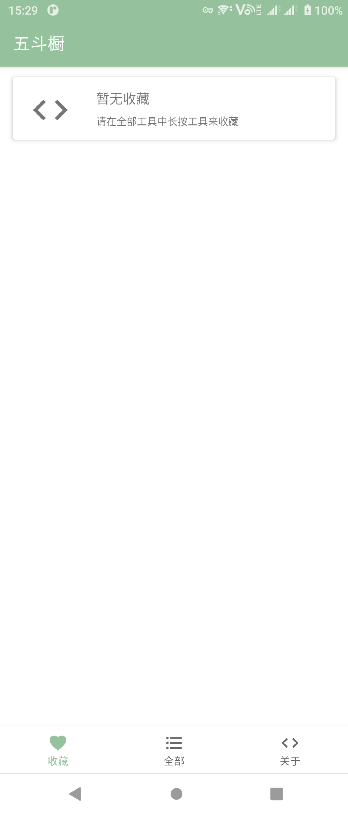
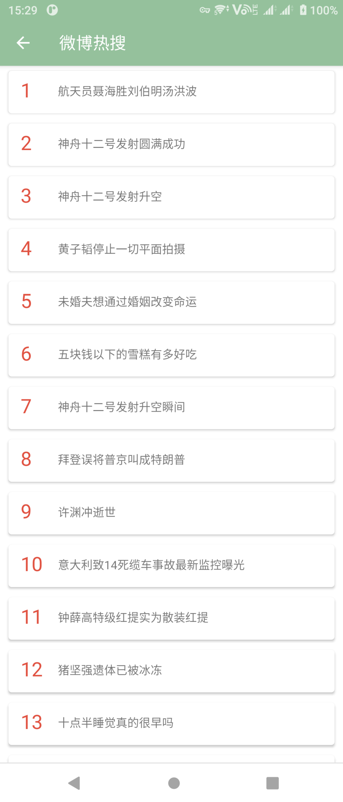

# 五斗橱 Chest Of Drawers

## 1. 简介 Introduction

This is a practical gadget application like One WoodenLetter.
这是一个类似于一个木函的安卓多功能工具箱

## 2. 开发计划 Development Plan

- [x] 微博热搜 Hot search on Weibo

- [x] 哔哩哔哩封面获取 Bilibili cover

- [x] 网络拼音缩写翻译 How to speak Chinese normally

- [ ] 一言 One Sentence

- [ ] 知乎日报 Zhihu Daily

- [ ] 英语句子（词霸来源） Daily English

- [ ] 哔哩哔哩热门视频 Hot video on Bilibili

- [ ] 天气查询 Weather

- [ ] 证券 Securities

  - [ ] 股票实时查询 Stock
  - [ ] 自选股 Self-selected stocks
  - [ ] 基金查询 Fund
  - [ ] 热点新闻 Financial news

- [ ] 历史上的今天 Today in history

- [ ] 每日新闻 Daily News

- [ ] 网络热词词典（小鸡词典） Internet words

- [ ] 尺子 Ruler

- [ ] 单位换算 Unit conversion

- [ ] 汇率转换 Exchange rate conversion

- [ ] 快递查询 Express inquiry

- [x] IP查询 IP query

- [ ] 号码归属地查询 Number attribution query

- [x] MD5摘要 MD5 encryption

- [x] Base64

- [ ] 中文数字大小写转换 Chinese number case conversion

- [ ] 短链接 Short Link

- [ ] 时钟显示 Clock

  

## 3. 接口使用 Interface Used(Chinese Only)

1. 微博热搜：[微博网页版](https://s.weibo.com/top/summary)  

   一个无害化的小微博爬虫

2. 哔哩哔哩封面获取：[视频信息接口](http://api.bilibili.com/x/web-interface/view)  

   使用方法查看[bilibili-API-collect](https://github.com/SocialSisterYi/bilibili-API-collect/blob/master/video/info.md)

3. 网络拼音缩写翻译：[能不能好好说话](https://lab.magiconch.com/nbnhhsh/)

   使用其[接口](https://lab.magiconch.com/api/nbnhhsh/guess)
   
4. IP查询：[IP-API](https://ip-api.com/)  

   使用其[接口](https://ip-api.com/json/)

## 4. 部分截图（早期开发中） Partial screenshot（Early development）

1. 全部功能 Main Page

   

   

2. 收藏 Favourite

   

    

3. 关于页面 About Page

   

    

4. 微博热搜 Hot search on Weibo

    

   

5. 网络拼音缩写翻译 How to speak Chinese normally

   

   

6. 哔哩哔哩封面获取 Bilibili cover

    
   
   
   
7. MD5

    

   

8. Base64

   
   
   

9. IP

   
   
   

10. Settings

       

   

11. License

       

   

12. Night Mode

       

   

## 5. 本地化与国际化 Localization and internationalization

- [x] 中文（简体） Chinese(Simplified)
- [x] 中文（繁体） Chinese(Traditional)
- [x] 英语（美国） English(America)
- [x] 日语 Japanese

## 6. 开发环境 Development environment

 -  JDK：1.8.0u211
 -  Gradle：6.7.1
 -  Min Target SDK：API26
 -  Target SDK：API30

## 7. 鸣谢 Thanks

1. [mikepenz/Android-Iconics](https://github.com/mikepenz/Android-Iconics)
2. [daniel-stoneuk/material-about-library](https://github.com/daniel-stoneuk/material-about-library)
3. [ybq/Android-SpinKit](https://github.com/ybq/Android-SpinKit)
4. [CymChad/BaseRecyclerViewAdapterHelper](https://github.com/CymChad/BaseRecyclerViewAdapterHelper)
5. [jhy/jsoup](https://github.com/jhy/jsoup)
6. [alibaba/fastjson](https://github.com/alibaba/fastjson)
7. [SocialSisterYi/bilibili-API-collect](https://github.com/SocialSisterYi/bilibili-API-collect)
8. [itorr/nbnhhsh](https://github.com/itorr/nbnhhsh)